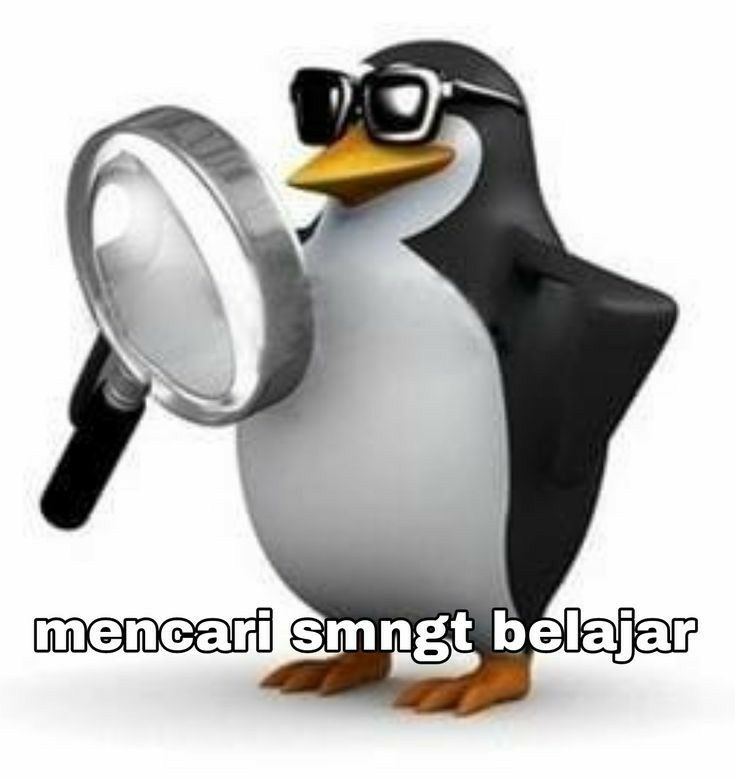

<html lang="id">
<head>
    <meta charset="UTF-8">
    <meta name="viewport" content="width=device-width, initial-scale=1.0">
    <title>Semangat UAS Ica!</title>
    
</head>
<body>

    

        
    

    <h1>SEMANGAT UAS ICAAA</h1>
    
🎵 tebak apa hayooo

    

        🎧 Play Dulu Woyy:
        <audio controls id="bg-music">
            <source src="yoyok.mp3" type="audio/mpeg">
            Browser kamu tidak mendukung pemutar audio.
        </audio>
    

    

        <button class="menu-btn active" onclick="switchTab('kesulitan')">Kesulitan</button>
        <button class="menu-btn" onclick="switchTab('harapan')">Harapan</button>
        <button class="menu-btn locked" id="btn-doa" onclick="switchTab('doa')">🔒 Doa Guweh</button>
    

    

        <h3>Ketik Keresahan yang Kamu Alami Saat Ini:</h3>
        

            <textarea id="input-kesulitan" placeholder="Tulis kesulitanmu di sini ca..."></textarea>
            <button class="submit-btn" onclick="addNote('kesulitan')">Submit</button>
        

        

    

    

        <h3>Ketik Harapan yang Ingin Kamu Capai:</h3>
        

            <textarea id="input-harapan" placeholder="Tulis harapan/impianmu di sini ca..."></textarea>
            <button class="submit-btn" onclick="addNote('harapan')">Submit</button>
        

        

    

    

        

            "Semoga lancar Ica UAS nya, gw percaya uas jadi game gampang buat lu, karna lu adalah orang yang teguh dann tekun ca! semangattt!" ✨💜
        

    

<script>
    // Variabel pengunci sistem
    let kesulitanSubmitted = false;
    let harapanSubmitted = false;

    // Fungsi untuk ganti menu/tab
    function switchTab(tabName) {
        // Jika klik menu doa tapi belum terbuka, abaikan
        if (tabName === 'doa' && (!kesulitanSubmitted || !harapanSubmitted)) {
            alert("Eitss! Kamu harus mengisi dan men-submit menu 'Kesulitan' dan 'Harapan' terlebih dahulu ya ca! 😉");
            return;
